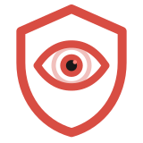
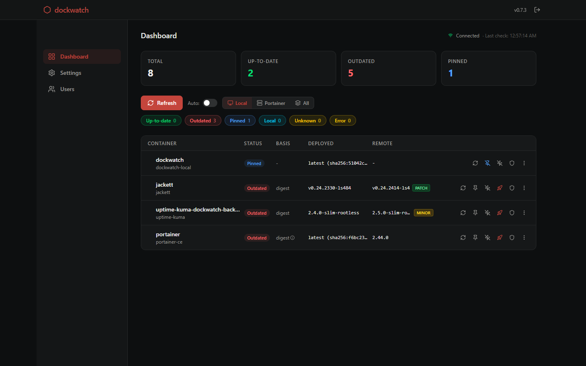

<p align="center"></p>

# dockwatch — a self-hosted Docker update watcher that keeps you in control



Most auto-updaters (Watchtower and friends) pull new images the moment they appear — no review, no confirmation, no history of what changed. dockwatch flips that: it checks your running containers against their registries, tells you what's outdated, and only updates when you click the button or run the command.

Please be aware that the application is under active development — read [PRODUCTION_READINESS.md](docs/PRODUCTION_READINESS.md) before relying on it for anything you can't afford to lose.

And don't forget about regular backups of important data — dockwatch backs up its own database automatically, but the containers it manages are on you.

Automatic updates are opt-in per container. Nothing updates unless you tell it to.

## Table of contents

- [main features](#main-features)
- [deploy](#deploy)
- [cli reference](#cli-reference)
- [configuration](#configuration)
- [authentication & rbac](#authentication--rbac)
- [notifications](#notifications)
- [portainer integration](#portainer-integration)
- [vulnerability scanning](#vulnerability-scanning-trivy)
- [check and update](./docs/CHECK_AND_UPDATE.md)
- [screenshots](./docs/SCREENSHOTS.md)
- [production readiness](./docs/PRODUCTION_READINESS.md)
- [troubleshooting](#troubleshooting)
- [development](#development)

## Main features

- Web dashboard with authentication and per-role permissions
- Digest-aware comparison, not just tag-string matching — catches `latest` silently pointing at a new image
- Multi-arch safe — compares your platform's digest, not the manifest list's
- Works with plain Docker or Portainer, local or remote hosts
- Approve-before-update by default; per-container auto-update is opt-in
- One-click rollback to the last known-good tag (compose-managed containers)
- Delete containers and images directly from the dashboard, with confirmation
- Full audit log — who updated/rolled-back/deleted what, and when
- Vulnerability scanning via bundled Trivy, cached by image ID
- Webhook / Discord / ntfy notifications, opt-in per event type
- CLI for scripts and cron jobs, same engine as the dashboard

## Deploy

- ### Quick start

  Prerequisites: Docker and Docker Compose. Trivy (vulnerability scanning) is bundled in the image.

  ```bash
  git clone <this-repo>
  cd dockwatch
  cp .env.example .env
  ```

  Edit `.env` — at minimum, set a real password:

  ```env
  DOCKWATCH_USERNAME=admin
  DOCKWATCH_PASSWORD=<pick something that isn't the placeholder>
  ```

  Then start it:

  ```bash
  docker compose up -d
  ```

  Dashboard is now at `http://localhost:10801` (or whatever `DOCKWATCH_PORT` you set). Log in with the credentials from `.env` — they're only consumed once, to bootstrap the first admin account.

  > [!IMPORTANT]
  > **Do not expose the dashboard to a network you don't control before an admin account exists.** Until the first account is created, `/register` is open to anyone who can reach it — the first visitor becomes admin. Setting `DOCKWATCH_USERNAME`/`DOCKWATCH_PASSWORD` in `.env` closes this window entirely; if you skip it, register immediately after starting the container.

- ### Linux: docker.sock permission

  If the dashboard shows zero containers after startup, this is almost always why. The container runs as a non-root user and needs group membership matching whatever group owns `/var/run/docker.sock` on your host — a wrong value fails **silently**, no error, dashboard just looks empty.

  ```bash
  # find your host's docker group GID
  getent group docker | cut -d: -f3
  ```

  Put the result in `.env`:

  ```env
  DOCKER_GID=<the GID from above>
  ```

  Docker Desktop (Windows/macOS): the socket inside the VM is owned by root — use `DOCKER_GID=0`.

  Recreate the container after changing `.env` — editing the file alone doesn't affect an already-running container:

  ```bash
  docker compose up -d --force-recreate
  ```

- ### Local Python install (no Docker) — for CLI-only use

  ```bash
  python -m pip install -e .
  dockwatch --help
  ```

  Requires Python 3.11+. The web dashboard (`dockwatch serve`) still needs access to a Docker socket to discover containers.

- ### Compose-managed container updates

  For dockwatch to update compose-managed containers (rewrite the tag in the compose file and re-deploy), it needs filesystem access to those compose files, and the project must be registered in Settings (workdir + file paths):

  - **Docker Desktop (Windows/macOS)**: mount `- /:/hostroot` and set `HOST_MOUNT_PREFIX=/hostroot` — dockwatch auto-translates Windows host paths to the Desktop VM's mount convention.
  - **Native Linux**: bind-mount only the specific directories containing your compose stacks (e.g. `/opt/stacks:/opt/stacks`); do **not** mount the whole host root. Leave `HOST_MOUNT_PREFIX` unset.

  The bundled `docker-compose.yml` runs as non-root, includes a healthcheck (`GET /health`), log rotation, resource limits (1 CPU / 512 MB), and `tini` for signal handling.

## CLI Reference

```
dockwatch list       [--source local|portainer|all] [--environment ID]
dockwatch check      [--container NAME] [--outdated-only] [--major-only]
                      [--json] [--notify] [--source local|portainer|all] [--environment ID]
dockwatch update     <container> [--yes] [--dry-run]
dockwatch scan       [--container NAME] [--json] [--source local|portainer|all] [--environment ID]
dockwatch environments
dockwatch pin        <container>
dockwatch unpin      <container>
dockwatch ignore     <container>
dockwatch unignore   <container>
dockwatch serve      [--host 0.0.0.0] [--port 8080]
dockwatch daemon     [--notify/--no-notify]
dockwatch version
dockwatch config list
dockwatch config set-password
dockwatch notify test
```

Common examples:

```bash
# check everything, show only what's outdated
dockwatch check --outdated-only

# check one container and update it after confirmation
dockwatch check --container nginx
dockwatch update nginx

# see the update plan without executing it
dockwatch update nginx --dry-run

# scan for CVEs
dockwatch scan --container nginx

# JSON output for scripts/cron
dockwatch check --json

# run continuously on a schedule, notify on changes
dockwatch daemon --notify

# include Portainer-managed containers
dockwatch check --source all
```

## Configuration

Config file lives at `~/.config/dockwatch/config.toml` (or the container's `dockwatch_config` volume). The dashboard's Settings page edits the same file.

```toml
notify_only = []
include_tags = []
exclude_tags = []
notify_on = ["update"]
first_check_notify = false
schedule_interval_seconds = 300
schedule_jitter_seconds = 30
run_on_startup = true
max_concurrent_checks = 5

[notifications]
webhook_url = ""
discord_webhook = ""
ntfy_url = ""

[portainer]
enabled = false
url = ""
api_key = ""
environments = []
deploy_timeout = 120.0

[trivy]
enabled = false
binary_path = "trivy"
severity = ["CRITICAL", "HIGH"]
scanners = ["vuln"]
timeout_seconds = 300
skip_db_update = false
cache_ttl_minutes = 60
```

<details>
<summary>Field reference</summary>

- `notify_only` — optional container-name allowlist for notifications
- `include_tags` / `exclude_tags` — regex allow/deny lists applied before latest-tag selection
- `notify_on` — event types that trigger a notification (`new`, `update`); digest drift always notifies regardless of this setting
- `first_check_notify` — whether first-time discovery of a container counts as notifiable
- `schedule_interval_seconds` / `schedule_jitter_seconds` — daemon mode check cadence
- `max_concurrent_checks` — parallel registry check limit
- `portainer.enabled` — turns on the Portainer source in CLI and dashboard
- `portainer.environments` — optional environment ID allowlist; empty means all visible environments
- `portainer.deploy_timeout` — seconds allowed for stack create/redeploy (image pull + recreate); default 120, raise it for large images
- `trivy.enabled` — must be `true` for scanning to work; opt-in by design (network + CPU cost)
- `trivy.cache_ttl_minutes` — how long a scan result is reused before re-scanning the same image ID

Pinned/ignored containers are stored in SQLite (`container_flags` table), not `config.toml` — manage them via CLI (`dockwatch pin`/`ignore`) or the dashboard checklist.
</details>

Relevant `.env` variables (container deploy only):

| Variable | Purpose |
| --- | --- |
| `DOCKER_GID` | Group ID owning the host's `docker.sock`, so the container's non-root user can read it |
| `DOCKWATCH_PORT` | Host port to publish the dashboard on |
| `DOCKWATCH_USERNAME` / `DOCKWATCH_PASSWORD` | Bootstrap credentials for the first admin account (consumed once) |
| `DOCKWATCH_ALLOW_REGISTRATION` | Allow self-service `/register` after the first account exists |
| `DOCKWATCH_SECURE_COOKIE` | Force the session cookie's `Secure` flag `true`/`false`. Unset by default: dockwatch auto-detects HTTPS (via request scheme or `X-Forwarded-Proto`) and marks the cookie `Secure` only when it sees it. Set explicitly to `true` if you're behind a reverse proxy that doesn't forward that header reliably; set to `false` to force plain HTTP even if HTTPS is detected |
| `DOCKWATCH_TRUSTED_PROXIES` | Comma-separated IPs/CIDRs (e.g. `172.18.0.0/16`) of reverse proxies trusted to set `X-Forwarded-For`. Unset = use the raw TCP peer IP for rate limiting/lockout (safe default) |

## Authentication & RBAC

Multi-user with permission-based access control — six fixed permissions (`view_containers`, `update_containers`, `delete_containers`, `scan_containers`, `manage_settings`, `manage_users`), combinable into custom roles.

| Built-in role | Permissions |
| --- | --- |
| `admin` | all six |
| `viewer` | `view_containers` only |

Create additional roles with any subset of permissions from the Users page (requires `manage_users`).

**Trust boundary**: `manage_settings`, `update_containers`, and `delete_containers` are effectively admin-equivalent, not safely delegable to a semi-trusted user — all three can reach the host's Docker daemon indirectly. Only grant these to people you'd trust with direct `docker.sock` access.

Sessions are signed cookies, 14-day expiry, no server-side session store.

## Notifications

Three notifier types, all opt-in: generic webhook (`POST` JSON), Discord webhook (embed payload), ntfy (`POST` plain text).

Trigger with `dockwatch check --notify`, `dockwatch daemon --notify`, or the dashboard's "Send Test Notification" button. Digest-drift events always notify regardless of `notify_on` filtering.

Per-container Docker label overrides (no config file edit needed):

```
dockwatch.enable=false
dockwatch.pin=true
dockwatch.ignore=true
dockwatch.notify=false
dockwatch.include_tags=^2\.
dockwatch.exclude_tags=-rc$
```

## Portainer Integration

Use Portainer as an additional container source — inspect, check, restart, update, and delete containers on remote Docker hosts without giving dockwatch direct socket access to them.

- **Setup walkthrough**: [PORTAINER_SETUP.md](docs/PORTAINER_SETUP.md)
- **Feature scope & programmatic API**: [PORTAINER_API.md](docs/PORTAINER_API.md)

## Vulnerability Scanning (Trivy)

Separate from update checks — inspects the *content* of the image currently running for known CVEs, not whether a newer tag exists.

- Bundled in the Docker image; native/pip installs need [Trivy](https://trivy.dev) installed separately (`brew install trivy` / `apt install trivy`).
- Must be explicitly enabled: `trivy.enabled = true` in config.
- Results are cached by Docker image ID — re-scanning only happens when the image actually changes or the cache TTL expires.
- Dashboard shows clickable severity bars (Critical/High/Medium/Low) that filter the findings list.

```bash
dockwatch scan --container nginx
dockwatch scan --json   # full CVE details: ID, package, installed/fixed version, severity
```

## Troubleshooting

**Update button missing for a `:latest` container** — floating tags can only be compared by digest. If the registry doesn't return a digest, or the digest matches what's deployed, there's genuinely nothing to update. Pin to a versioned tag (e.g. `image:2.20.0`) for reliable version-based comparison.

**Dashboard shows zero containers** — almost always the `DOCKER_GID` mismatch described in [Deploy](#deploy). No error surfaces; discovery just silently returns nothing.

**`Could not connect to Docker`** — confirm the daemon is running and the socket/pipe is reachable from inside the container; re-run the check after the daemon recovers.

**Notifications not sending** — confirm the webhook URL is reachable, use the dashboard's "Send Test Notification," or run `dockwatch check --notify` directly and read the notifier error output.

See also: [FAQ.md](docs/FAQ.md)

## Development

```bash
python -m pytest -q       # run tests
ruff check src tests      # lint
mypy src                  # type-check
```

CI (`.github/workflows/ci.yml`) runs all three on every push.

## License

MIT — see [LICENSE](LICENSE).
